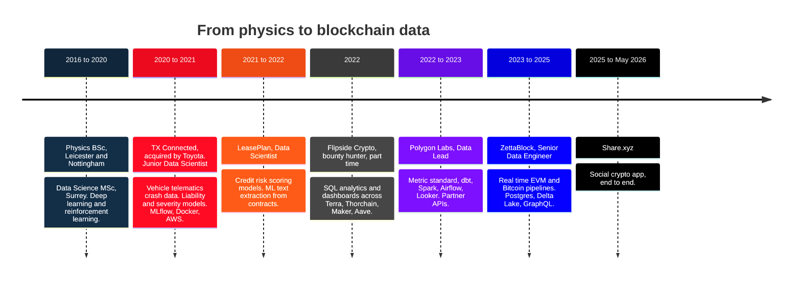
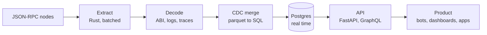

<h1 align="center">Konstantinos</h1>

  <b>Backend Software Engineer · Data Engineer · Data Scientist</b> 
  Physics first, then machine learning, then blockchain data. 
  Greater London Area, United Kingdom

  
  

I build blockchain data pipelines, real time Postgres systems, and the products that sit on top of them.
I take an early stage idea from a proof of concept to a released `v1.0.0`.

---

## Path

## Experience

| Period | Where | Role and work |
| :--- | :--- | :--- |
| 2025 to May 2026 | **[Share.xyz](https://about.share.xyz/)** | Social crypto app. Backend, pipelines and product, end to end. |
| Mar 2023 to 2025 | **[ZettaBlock](https://zettablock.com/)** | Senior Data Engineer, Data Scientist and Analytics Engineer. Core EVM data infrastructure. Raised decoded table rates on core ingested tables and built the abstraction layers above them. Wrote pipelines into a Presto, Athena and SparkSQL compatible Delta Lake, and into PostgreSQL, on the AWS stack. Built the real time **Ingestor** and real time **Balances** on PostgreSQL with `asyncio`. Optimised a complexity based query routing heuristic that dispatched user queries between Presto, Athena and PostgreSQL, so the engine stayed invisible to the user. dbt for transforms, MySQL for user management. |
| Apr 2022 to Apr 2023 | **[Polygon Labs](https://polygon.technology/about)** | Data Lead, Data Scientist and Analytics Engineer. Ran the pipelines and analytics infrastructure behind internal BI on Looker and dbt. Built and maintained APIs that served the business development and marketing teams, and external partners including **Starbucks** and **Reddit**. Standardised the metric methodology for Network, DeFi, NFT and Gaming data. Moved heavy Python jobs to PySpark on Dataproc. Refactored the Airflow DAGs and the SQL behind them. Wrote research reports and data models for product and growth decisions. |
| 2022, part time | **[Flipside Crypto](https://flipsidecrypto.xyz/)** | Bounty hunter. SQL analytics and dashboards across Terra, Thorchain, Maker and Aave. Reached Elite tier. |
| Nov 2021 to Apr 2022 | **[LeasePlan](https://www.leaseplan.com/en-gb/)** | Data Scientist. Built credit risk scoring models for private individuals. Led feature discovery, analytics and model development. Added ML text extraction to compare PDF contracts. |
| Jun 2020 to Oct 2021 | **[TX Connected](https://www.linkedin.com/company/txconnected/)**, acquired by Toyota | Junior Data Scientist, crashmatics group. Vehicle telematics crash data. Driver liability and accident severity models. Feature engineering from physics signals. MLflow, Docker and AWS for deployment. |

**Education.** Data Science MSc, University of Surrey. Theoretical and Mathematical Physics BSc, University of Nottingham. Physics BSc, University of Leicester.

---

## What I build

**Blockchain pipeline engineering.** Extraction from JSON-RPC to parquet, then ABI decoding of logs, calls and traces, then load into SQL. Gap fill, reorg handling and backfill included.

**Real time Postgres.** Change data capture with `COPY` into a temporary table, then `MERGE`. Partitions, indexes and vacuum policy for tables that grow with every block. Real time balances at chain tip.

**Query routing.** Send each query to the engine that suits it. Postgres for point reads and low latency, Presto or Athena for large scans. The caller sees one interface.

**End to end products.** FastAPI and GraphQL services, Telegram bots, dashboards and the schema underneath them.

---

## Selected work

Public repositories below. Most recent pipeline and product work sits in private
repositories, so it is described in general terms without links.

| Repository | What it is |
| :--- | :--- |
| [triodion](https://github.com/KonScanner/triodion) | Rust. Extracts EVM data to parquet, csv or json. Derived from [paradigmxyz/cryo](https://github.com/paradigmxyz/cryo), with Multicall3 batching, coalesced log extraction and JSON-RPC request batching. |
| [hyperliquid-trader-tracker](https://github.com/KonScanner/hyperliquid-trader-tracker) | Rust. Telegram bot that tracks Hyperliquid wallets. One edit in place card per perp position, with PnL, ROI, leverage and liquidation price. No keys needed. |
| [flipsideClaimBot](https://github.com/KonScanner/flipsideClaimBot) | Python. Claimed Flipside bounties that dropped overnight. Now a public archive. |
| [Terralytics](https://github.com/KonScanner/Terralytics) | Terra ecosystem analytics from the Flipside years. |
| [Predicting_Accidents_proj](https://github.com/KonScanner/Predicting_Accidents_proj) | R. UK road accident severity, 2005 to 2015. Cleaning, k means clustering and prediction. University of Surrey. |
| [transitionMatrix](https://github.com/KonScanner/transitionMatrix) | State transition analysis, used for credit rating migration. Fork of [open-risk/transitionMatrix](https://github.com/open-risk/transitionMatrix). |

<b>Blockchain data and ingestion</b>

| Repository | What it is |
| :--- | :--- |
| [triodion](https://github.com/KonScanner/triodion) | EVM extraction to parquet, csv and json. Rust. |
| [lazy-contract-mapping](https://github.com/KonScanner/lazy-contract-mapping) | Scrapy tool that maps contract addresses to labels. |
| [chainlist_scraper](https://github.com/KonScanner/chainlist_scraper) | Scrapes chain metadata from public chain lists. |

**Private repositories** hold change data capture from parquet into per chain Postgres schemas, a real time Bitcoin ingestor on PostgreSQL, EVM and Cosmos ingestors in Go, ABI parsing, a TimescaleDB evaluation, Dagster orchestration and zkEVM testnet work.

<b>Analytics, the Flipside and Polygon years</b>

| Repository | What it is |
| :--- | :--- |
| [flipsideClaimBot](https://github.com/KonScanner/flipsideClaimBot) | Bounty claim bot. Archived. |
| [Terralytics](https://github.com/KonScanner/Terralytics) | Terra ecosystem analytics. |
| [maker-dao](https://github.com/KonScanner/maker-dao) | Maker DAO analysis. |
| [Polygon-x-Sushi](https://github.com/KonScanner/Polygon-x-Sushi) | Sushi contribution to Polygon growth. |
| [retention-dashboard](https://github.com/KonScanner/retention-dashboard) | Retention metrics dashboard. |
| [Cashboard](https://github.com/KonScanner/Cashboard) | Dashboard for monitoring cryptocurrencies. |
| [synthr-farming](https://github.com/KonScanner/synthr-farming) | Synthr action farming scripts. |
| [Onchain_Analysis](https://github.com/KonScanner/Onchain_Analysis) | On chain analysis toolkit. Fork of [readysetcryptocodes/Onchain_Analysis](https://github.com/readysetcryptocodes/Onchain_Analysis). |
| [Blockchain Data Analytics](https://kowalski-defi.notion.site/Blockchain-Data-Analytics-ec45d5b9e1514cdd94f7f701c3f3e9a4) | A Notion series I write. Case studies that run from exploratory analysis to decoding contract logic, including decoded tables from raw logs and a piece on smart contract mutability. |

**Private repositories** hold Flipside reporting, Thorchain and staked Aave dashboards, ecosystem value modelling, growth and competitive metrics, and Terra SDK utilities.

<b>Machine learning, reinforcement learning and physics</b>

| Repository | What it is |
| :--- | :--- |
| [Predicting_Accidents_proj](https://github.com/KonScanner/Predicting_Accidents_proj) | R. UK road accident severity, 2005 to 2015. University of Surrey. |
| [transitionMatrix](https://github.com/KonScanner/transitionMatrix) | State transition analysis for credit rating migration. Fork of [open-risk/transitionMatrix](https://github.com/open-risk/transitionMatrix). |
| [pytorch-Deep-Learning](https://github.com/KonScanner/pytorch-Deep-Learning) | Deep learning with PyTorch. Fork of the NYU course by [Atcold](https://github.com/Atcold/NYU-DLSP20). |
| [TensorFlow_CertificationNotes](https://github.com/KonScanner/TensorFlow_CertificationNotes) | TensorFlow certification notes. |
| [Simple-Harmonic-Oscillator](https://github.com/KonScanner/Simple-Harmonic-Oscillator) | Physics simulation. |
| [computer-vision-cloud9](https://github.com/KonScanner/computer-vision-cloud9) | Computer vision on AWS Cloud9. |
| [mpl-style](https://github.com/KonScanner/mpl-style) | Custom matplotlib style. |

**Private repositories** hold reinforcement learning method work, the NYU deep learning course track, an impact event reader for telematics signals, and a Kaggle entry.

<b>Backend, tooling and side projects</b>

| Repository | What it is |
| :--- | :--- |
| [fappiTemp](https://github.com/KonScanner/fappiTemp) | FastAPI template with Postgres. |
| [Business_Solution](https://github.com/KonScanner/Business_Solution) | Business database solution in PL/pgSQL. |
| [macro-bot-telegram](https://github.com/KonScanner/macro-bot-telegram) | Macro statistics over Telegram. |
| [dispmail](https://github.com/KonScanner/dispmail) | Disposable email. Sign up for services without giving personal information away. |
| [image_toolkit](https://github.com/KonScanner/image_toolkit) | Image processing utilities. |
| [Golang-fundamentals](https://github.com/KonScanner/Golang-fundamentals) | Go fundamentals. |
| [ETH_mine_hodler](https://github.com/KonScanner/ETH_mine_hodler) | Mining payout history measured against price. |
| [CookBook](https://github.com/KonScanner/CookBook) | Personal engineering cookbook. |

**Private repositories** hold FastAPI web3 scaffolding, data APIs, Hyperliquid strategy and trading tools, crypto tax statement tools, secret encryption, basketball data work and a research aggregator.

---

## Stack

| Layer | Tools |
| :--- | :--- |
| Languages | Python, Rust, Go, SQL, TypeScript, R |
| Databases | PostgreSQL, TimescaleDB, MySQL, DuckDB, Redshift |
| Query engines | Presto, Athena, SparkSQL, Delta Lake, Iceberg, Parquet |
| Transform | dbt, Spark, Pandas, NumPy |
| Orchestration | Airflow, Dagster, `asyncio` |
| Services | FastAPI, Flask, GraphQL |
| ML | PyTorch, TensorFlow, scikit-learn, MLflow, Hugging Face |
| Chains | EVM, Bitcoin, Cosmos, Terra, Hyperliquid. Alchemy and QuickNode. |
| Cloud | AWS, GCP, Docker, Kubernetes |
| BI | Looker |

---

## Now

I work with early stage teams and help them ship. Give me a proof of concept and I take the product to a released `v1.0.0`. I cover what the build needs, from the backend and the data underneath to the interface the user touches. I write the code myself.

Reach me on [LinkedIn](https://www.linkedin.com/in/kostas-komp/).

Away from the keyboard: guitar, bass and basketball.
