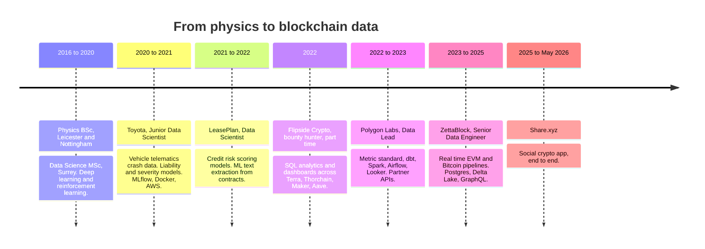
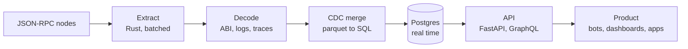

<h1 align="center">Konstantinos Kompogiannopoulos</h1>

  <b>Backend Software Engineer · Data Engineer · Data Scientist</b> 
  Physics first, then machine learning, then blockchain data. 
  Greater London Area, United Kingdom

  
  

I build blockchain data pipelines, real time Postgres systems, and the products that sit on top of them.
I take an early stage idea from a proof of concept to a released `v1.0.0`.

---

## Path

## Experience

| Period | Where | Role and work |
| :--- | :--- | :--- |
| 2025 to May 2026 | **Share.xyz** | Social crypto app. Backend, pipelines and product, end to end. |
| Mar 2023 to 2025 | **[ZettaBlock](https://zettablock.com/)** | Senior Data Engineer, Data Scientist and Analytics Engineer. Core EVM data infrastructure. Raised decoded table rates on core ingested tables and built the abstraction layers above them. Wrote pipelines into a Presto, Athena and SparkSQL compatible Delta Lake, and into PostgreSQL, on the AWS stack. Built the real time **Ingestor** and real time **Balances** on PostgreSQL with `asyncio`. Optimised a complexity based query routing heuristic that dispatched user queries between Presto, Athena and PostgreSQL, so the engine stayed invisible to the user. dbt for transforms, MySQL for user management. |
| Apr 2022 to Apr 2023 | **[Polygon Labs](https://polygon.technology/about)** | Data Lead, Data Scientist and Analytics Engineer. Ran the pipelines and analytics infrastructure behind internal BI on Looker and dbt. Built and maintained APIs that served the business development and marketing teams, and external partners including **Starbucks** and **Reddit**. Standardised the metric methodology for Network, DeFi, NFT and Gaming data. Moved heavy Python jobs to PySpark on Dataproc. Refactored the Airflow DAGs and the SQL behind them. Wrote research reports and data models for product and growth decisions. |
| 2022, part time | **Flipside Crypto** | Bounty hunter. SQL analytics and dashboards across Terra, Thorchain, Maker and Aave. Reached Elite tier. |
| Nov 2021 to Apr 2022 | **LeasePlan** | Data Scientist. Built credit risk scoring models for private individuals. Led feature discovery, analytics and model development. Added ML text extraction to compare PDF contracts. |
| Jun 2020 to Oct 2021 | **Toyota** | Junior Data Scientist, crashmatics group. Vehicle telematics crash data. Driver liability and accident severity models. Feature engineering from physics signals. MLflow, Docker and AWS for deployment. |

**Education.** Data Science MSc, University of Surrey. Theoretical and Mathematical Physics BSc, University of Nottingham. Physics BSc, University of Leicester.

---

## What I build

**Blockchain pipeline engineering.** Extraction from JSON-RPC to parquet, then ABI decoding of logs, calls and traces, then load into SQL. Gap fill, reorg handling and backfill included.

**Real time Postgres.** Change data capture with `COPY` into a temporary table, then `MERGE`. Partitions, indexes and vacuum policy for tables that grow with every block. Real time balances at chain tip.

**Query routing.** Send each query to the engine that suits it. Postgres for point reads and low latency, Presto or Athena for large scans. The caller sees one interface.

**End to end products.** FastAPI and GraphQL services, Telegram bots, dashboards and the schema underneath them.

---

## Selected work

| Repository | What it is |
| :--- | :--- |
| [triodion](https://github.com/KonScanner/triodion) | Rust. Extracts EVM data to parquet, csv or json. Fork of [paradigmxyz/cryo](https://github.com/paradigmxyz/cryo) with Multicall3 batching, coalesced log extraction and JSON-RPC request batching. |
| [cdc-homie](https://github.com/KonScanner/cdc-homie) | Triodion driven ETL with change data capture into Postgres. Parquet acts as the buffer. DuckDB and `psycopg`, `COPY` to temp table to `MERGE`. |
| [bitcoin-rt](https://github.com/KonScanner/bitcoin-rt) | Go. Real time Bitcoin ingestor on PostgreSQL. |
| [hyperliquid-trader-tracker](https://github.com/KonScanner/hyperliquid-trader-tracker) | Rust. Telegram bot that tracks Hyperliquid wallets. One edit in place card per perp position, with PnL, ROI, leverage and liquidation price. No keys needed. |
| [hyperdash-edge-finder](https://github.com/KonScanner/hyperdash-edge-finder) | Scraper and edge finder toolkit. Strategy build, backtest and sweep optimiser. |
| [flipsideClaimBot](https://github.com/KonScanner/flipsideClaimBot) | Python. Claimed Flipside bounties that dropped overnight. Now a public archive. |

<b>Blockchain data and ingestion</b>

| Repository | What it is |
| :--- | :--- |
| [triodion](https://github.com/KonScanner/triodion) | EVM extraction to parquet, csv, json. Rust. |
| [cdc-homie](https://github.com/KonScanner/cdc-homie) | CDC from parquet into per chain Postgres schemas. |
| [bitcoin-rt](https://github.com/KonScanner/bitcoin-rt) | Real time Bitcoin ingestor, PostgreSQL. Go. |
| [go-ingest-evm](https://github.com/KonScanner/go-ingest-evm) | EVM ingestor in Go. |
| [diy-ingestor](https://github.com/KonScanner/diy-ingestor) · [ingestor](https://github.com/KonScanner/ingestor) | Ingestion experiments. |
| [scaling-broccoli](https://github.com/KonScanner/scaling-broccoli) | Cosmos ingestion experiment. |
| [abi_parser_poc](https://github.com/KonScanner/abi_parser_poc) | ABI parsing proof of concept. |
| [lazy-contract-mapping](https://github.com/KonScanner/lazy-contract-mapping) | Scrapy tool that maps contract addresses to labels. |
| [go-coinmarketcap-timescaledb](https://github.com/KonScanner/go-coinmarketcap-timescaledb) | TimescaleDB benefits and limits, measured. |
| [dagster-setup](https://github.com/KonScanner/dagster-setup) | Dagster orchestration setup. |
| [eigen-go](https://github.com/KonScanner/eigen-go) · [kakarot-zk-drop](https://github.com/KonScanner/kakarot-zk-drop) · [zkevm-node-testnet](https://github.com/KonScanner/zkevm-node-testnet) | Node and protocol testnet work. |

<b>Analytics, the Flipside and Polygon years</b>

| Repository | What it is |
| :--- | :--- |
| [flipsideClaimBot](https://github.com/KonScanner/flipsideClaimBot) | Bounty claim bot. Archived. |
| [on-the-flip](https://github.com/KonScanner/on-the-flip) | Flipside reporting repository. |
| [Terralytics](https://github.com/KonScanner/Terralytics) · [terra_utils](https://github.com/KonScanner/terra_utils) | Terra analytics and SDK utilities. |
| [thorchain](https://github.com/KonScanner/thorchain) | Thorchain dashboard. |
| [maker-dao](https://github.com/KonScanner/maker-dao) · [staked-aave-dashboard](https://github.com/KonScanner/staked-aave-dashboard) | Protocol dashboards. |
| [Polygon-x-Sushi](https://github.com/KonScanner/Polygon-x-Sushi) | Sushi contribution to Polygon growth. |
| [ecosystem-value-modeling](https://github.com/KonScanner/ecosystem-value-modeling) | Realised value of an ecosystem from on chain data. |
| [growth-gold-standards](https://github.com/KonScanner/growth-gold-standards) · [retention-dashboard](https://github.com/KonScanner/retention-dashboard) · [competitive-analytics](https://github.com/KonScanner/competitive-analytics) | Growth, retention and competitive metrics. |
| [Onchain_Analysis](https://github.com/KonScanner/Onchain_Analysis) · [chainlist_scraper](https://github.com/KonScanner/chainlist_scraper) | On chain toolkit and chain list scraper. |
| [Decoding logs, a Notion write up](https://kowalski-defi.notion.site/Decoded-Tables-for-Novices-Using-Logs-71565bae666e4be3b95606a163f4594d) | How to build decoded tables from raw logs. |

<b>Machine learning, reinforcement learning and physics</b>

| Repository | What it is |
| :--- | :--- |
| [Predicting_Accidents_proj](https://github.com/KonScanner/Predicting_Accidents_proj) | R. UK road accident severity, 2005 to 2015. Cleaning, k means clustering and prediction. University of Surrey. |
| [RL-learning-curve](https://github.com/KonScanner/RL-learning-curve) | Reinforcement learning methods. |
| [pytorch-Deep-Learning](https://github.com/KonScanner/pytorch-Deep-Learning) · [YLCunDLCProgress](https://github.com/KonScanner/YLCunDLCProgress) | Deep learning with PyTorch, NYU course track. |
| [TensorFlow_CertificationNotes](https://github.com/KonScanner/TensorFlow_CertificationNotes) | TensorFlow certification notes. |
| [transitionMatrix](https://github.com/KonScanner/transitionMatrix) | State transition analysis. Used for credit rating migration. |
| [impact-events-st](https://github.com/KonScanner/impact-events-st) | Impact event reader and viewer. |
| [Simple-Harmonic-Oscillator](https://github.com/KonScanner/Simple-Harmonic-Oscillator) | Physics simulation. |
| [computer-vision-cloud9](https://github.com/KonScanner/computer-vision-cloud9) · [kaggle-march-maddness](https://github.com/KonScanner/kaggle-march-maddness) | Computer vision on AWS and a Kaggle entry. |
| [mpl-style](https://github.com/KonScanner/mpl-style) | Custom matplotlib style. |

<b>Backend, tooling and side projects</b>

| Repository | What it is |
| :--- | :--- |
| [fappiTemp](https://github.com/KonScanner/fappiTemp) · [backendReady](https://github.com/KonScanner/backendReady) | FastAPI templates with Postgres. |
| [fast-api-scaffolding-web3-project](https://github.com/KonScanner/fast-api-scaffolding-web3-project) | FastAPI scaffolding for web3 projects. |
| [personal-data-api](https://github.com/KonScanner/personal-data-api) · [0xDarwinAPI](https://github.com/KonScanner/0xDarwinAPI) | Data APIs. |
| [hyperliquid-edge-finder-trader](https://github.com/KonScanner/hyperliquid-edge-finder-trader) | Live Hyperliquid trading, backtest, sweep optimiser and paper or live supervisor. |
| [macro-bot-telegram](https://github.com/KonScanner/macro-bot-telegram) | Macro statistics over Telegram. |
| [tax-balancer](https://github.com/KonScanner/tax-balancer) · [taxify-this](https://github.com/KonScanner/taxify-this) | Free crypto tax statements. |
| [protect-my-secrets](https://github.com/KonScanner/protect-my-secrets) · [dispmail](https://github.com/KonScanner/dispmail) | Secret encryption and disposable email. |
| [not-basketaki](https://github.com/KonScanner/not-basketaki) · [Overtimer](https://github.com/KonScanner/Overtimer) · [overtime-groove](https://github.com/KonScanner/overtime-groove) | Basketball data and site work. |
| [scientific-researcher](https://github.com/KonScanner/scientific-researcher) | Research pieces in one searchable design. |
| [CookBook](https://github.com/KonScanner/CookBook) | Personal engineering cookbook. |

---

## Stack

| Layer | Tools |
| :--- | :--- |
| Languages | Python, Rust, Go, SQL, TypeScript, R |
| Databases | PostgreSQL, TimescaleDB, MySQL, DuckDB, Redshift |
| Query engines | Presto, Athena, SparkSQL, Delta Lake, Iceberg, Parquet |
| Transform | dbt, Spark, Pandas, NumPy |
| Orchestration | Airflow, Dagster, `asyncio` |
| Services | FastAPI, Flask, GraphQL |
| ML | PyTorch, TensorFlow, scikit-learn, MLflow, Hugging Face |
| Chains | EVM, Bitcoin, Cosmos, Terra, Hyperliquid. Alchemy and QuickNode. |
| Cloud | AWS, GCP, Docker, Kubernetes |
| BI | Looker |

---

## Now

I work with early stage teams. Give me a proof of concept and I return a `v1.0.0`: schema, pipeline, API and the interface that shows the data. I write the code myself.

Reach me on [LinkedIn](https://www.linkedin.com/in/kostas-komp/).

Away from the keyboard: guitar, bass and basketball.
